# 🏛️ ITECHEngage

ITECHEngage is a premium, secure, and modern full-stack student engagement portal designed for the Polytechnic University of the Philippines. Built with **Next.js 16**, **React 19**, and **Supabase**, the platform streamlines student organization accreditation, event attendance tracking via QR codes, bulletin announcements, elections, and role-based student records.

---

## 🌟 Key Features

The portal offers a robust suite of tools tailored for students, student officers, and administrators:

### 1. 👥 Role-Based Access Control (RBAC)
* **Dynamic Role Escalation**: Students who join organizations are automatically recognized as **Student Officers** once their memberships are approved.
* **Admin User Management Roster**: Administrators have access to a centralized dashboard where they can search and view profiles, assign/revoke organizational positions, and manage student account statuses.
* **Custom Navigation Guards**: Sidebar items and dashboard quick-actions dynamically filter out administrative features for students and student officers.

### 2. 🛡️ Verification Pipeline & Database Hygiene
* **Extended Student Profile fields**: Collects essential academic info (Program, Course, Section, Year Level) during signup.
* **Middleware Verification Guards**: Restricts new registrations to a `pending_verification` state. Unverified users are redirected to a pending screen, allowing access only to safe operations (e.g. sign-out).
* **Safe Account Deletion**: Leverages PostgreSQL cascade actions (`ON DELETE SET NULL`/`ON DELETE CASCADE`) to allow admins to safely delete user accounts without breaking storage objects or existing event publications.

### 3. 🏢 Organization & Accreditation Management
* **Horizontal Pill Filters**: Clean, responsive horizontal category pill filters on the homepage and organization grids, allowing students to filter organizations by department or type.
* **Non-accredited Org Access**: Allows admins and student officers to initialize accreditation workflows and manage organizations efficiently.

### 4. 📌 Interactive Announcements & Vacancies
* **Bulletin Board**: A unified, pinned bulletin board displaying announcements, special news, and top-liked events (auto-promoted after reaching specified engagement thresholds).
* **Officer Recruitment Portal**: Enables student officers to post vacancies for organizational positions and manage applicant lists.

### 5. 📅 Event & QR Attendance Tracking
* **QR Check-in System**: Secure, instant event attendance verification via scanned QR codes that automatically update student co-curricular portfolios.
* **Real-time Interactions**: Live event publications, comments, likes, and feedback powered by Supabase Realtime synchronization.

---

## 🛠️ Tech Stack

| Layer | Technology | Version | Purpose |
|---|---|---|---|
| **Frontend Framework** | Next.js (App Router, Turbopack) | `16.1.6` | Production-grade React framework |
| **Component Core** | React | `19.2.3` | User interface rendering |
| **Styling** | Tailwind CSS | `4` | Utilitarian styling and dark-mode configuration |
| **Icons** | Lucide React | `0.564.0` | Sleek SVG icons replacing emojis |
| **Backend & DB** | Supabase | `^2.95.3` | PostgreSQL DB, Auth, and Storage |
| **Testing** | Vitest | `4.1.5` | Rapid unit testing and TDD coverage |

---

## 📊 Database Architecture

The backend database runs on PostgreSQL (managed via Supabase). Row-Level Security (RLS) is fully active across all tables, utilizing `SECURITY DEFINER` functions to resolve circular RLS dependencies.

```mermaid
erDiagram

    profiles {
        uuid id PK
        text email
        text full_name
        text role "student | officer | admin"
        text account_status "pending_verification | verified | rejected"
        text bio
        text track_record
    }

    students {
        uuid id PK, FK
        text student_number
        text program
        integer year_level
        text school_email
        text course
        text section
    }

    organizations {
        uuid id PK
        text name
        text description
        text visibility "public | private"
        text accreditation_status "pending | approved | rejected"
        uuid category_id FK
    }

    memberships {
        uuid id PK
        uuid user_id FK
        uuid organization_id FK
        text role "member | officer"
        text status "pending | approved | rejected"
    }

    organization_roles {
        uuid id PK
        uuid organization_id FK
        text title
        integer hierarchy_level
        boolean can_manage_roles
        uuid assigned_user_id FK
        uuid parent_role_id FK
    }

    events {
        uuid id PK
        uuid organization_id FK
        text title
        timestamptz start_datetime
        timestamptz end_datetime
        text location
        integer max_participants
        text status "draft | active | completed"
    }

    event_participations {
        uuid id PK
        uuid event_id FK
        uuid user_id FK
        text status "registered | attended"
        timestamptz registered_at
    }

    elections {
        uuid id PK
        uuid organization_id FK
        text title
        timestamptz start_date
        timestamptz end_date
        text status "draft | active | closed"
    }

    candidates {
        uuid id PK
        uuid election_id FK
        uuid user_id FK
        text position
        uuid organization_role_id FK
    }

    votes {
        uuid id PK
        uuid election_id FK
        uuid membership_id FK
        uuid candidate_id FK
    }

    accreditations {
        uuid id PK
        uuid organization_id FK
        text academic_year
        text status "pending | approved | rejected"
        text cycle_type
        date deadline
    }

    bulletin_board_posts {
        uuid id PK
        text type "news | event | recruitment | system | special"
        text title
        text body
        boolean pinned
        uuid organization_id FK
        timestamptz expires_at
    }

    notifications {
        uuid id PK
        uuid user_id FK
        text type
        text title
        text message
        boolean is_read
    }

    engagement_records {
        uuid id PK
        uuid user_id FK
        uuid organization_id FK
        uuid event_id FK
        text record_type "membership | officer_role | event_attended"
        numeric hours_credit
        boolean verified
    }


    profiles ||--|| students : "extended profile"

    profiles ||--o{ memberships : "joins"
    organizations ||--o{ memberships : "accepts members"

    organizations ||--o{ organization_roles : "defines roles"
    profiles ||--o{ organization_roles : "assigned role"

    organizations ||--o{ events : "organizes"
    events ||--o{ event_participations : "registrations"
    profiles ||--o{ event_participations : "participates"

    organizations ||--o{ elections : "conducts"
    elections ||--o{ candidates : "contains candidates"
    candidates ||--o{ votes : "receives votes"

    organizations ||--o{ accreditations : "submits"

    organizations ||--o{ bulletin_board_posts : "publishes"

    profiles ||--o{ notifications : "receives"

    profiles ||--o{ engagement_records : "earns"
    organizations ||--o{ engagement_records : "issues"
    events ||--o{ engagement_records : "generates"
```



---

## 🚀 Getting Started

### 📋 Prerequisites
Ensure the following are installed:
* **Node.js** 18+ (LTS)
* **npm** or **pnpm**
* **Git**

### 1. Install Dependencies
```bash
npm install
```

### 2. Configure Environment Variables
Create a `.env.local` file in the root of the project:
```env
NEXT_PUBLIC_SUPABASE_URL=your_supabase_project_url
NEXT_PUBLIC_SUPABASE_ANON_KEY=your_supabase_public_anon_key
```
## 📚 Project Structure

```
src/
├── app/                  # Next.js App Router Structure
│   ├── dashboard/        # Authenticated Admin/Officer/Student Dashboard Pages
│   │   ├── admin/        # Admin Control Panel (Roster, Verifications, System Comms)
│   │   ├── accreditation/# Organizational Accreditation pipelines
│   │   ├── bulletin/     # Interactive Announcements Board
│   │   └── recruitment/  # Recruitment posting dashboard for officers
│   ├── login/            # Authentication Sign-in screen
│   ├── signup/           # Course & Section-aware registration forms
│   └── page.tsx          # Public Landing Page
├── components/           # Reusable components (Sidebar, PageTransition overlays)
├── lib/                  # Utilities, actions, hooks, and client definitions
│   ├── supabase/         # Server, client, and admin client initializers
│   └── actions/          # Type-safe Next.js Server Actions (Profile, Admin, etc.)
├── styles/               # CSS utility structures and Tailwind configurations
└── __tests__/            # Core test suites (TDD verification)
```

---

## 🎨 Design & Accessibility Standards

ITECHEngage adheres to highly-polished design guidelines to ensure institutional credibility:
* **Branded Theme**: PUP Maroon (`#800000`), Gold (`#C9A227`), and Charcoal (`#2B2B2B`) are preserved across both Light and Dark mode variations.
* **Geometric Typography**: Authoritative headings use **Poppins** pairings, while the body uses clean, highly-readable **Inter**.
* **WCAG 2.1 AA Compliance**: Support for `prefers-reduced-motion` to silence layout animation loops for vestibular-sensitive users, alongside outline focus rings for keyboard navigation accessibility.
* **Micro-interactions**: Clean client-side page progress indicator loading states and custom layout transition overlays.

---

## 🧪 Running Tests

Verify typescript configurations and feature behavior:
```bash
npm run test
```

---

## 📄 License
This project is private and proprietary. All rights reserved.
