<div align="center">

# 🏛️ ITECHEngage

### *Where student life, leadership, and recognition come together.*

A premium, secure, full-stack student engagement portal for the **Polytechnic University of the Philippines — Institute of Technology**. From organization accreditation to QR-powered attendance, elections, and a personal co-curricular résumé, ITECHEngage turns scattered campus activity into one connected experience.

<br/>


</div>

---

## ✨ Why ITECHEngage?

Campus engagement usually lives in a dozen places — group chats, spreadsheets, paper forms, and bulletin boards. ITECHEngage replaces all of it with a single, role-aware platform where **every activity a student joins becomes part of their verifiable record**.

> 🎓 Attend an event, win an election, lead an org — and watch it land automatically on your exportable co-curricular résumé.

---

## 👤 Built for Three Kinds of People

| | **Students** | **Student Officers** | **Administrators** |
|---|---|---|---|
| **See** | Orgs, events, elections, bulletin | Their org's operations dashboard | Campus-wide control panel |
| **Do** | Join orgs, RSVP, vote, check in via QR | Approve members, post news/events/recruitment, edit their org profile | Verify accounts, manage roles, run accreditation |
| **Get** | A living résumé of everything they've done | A one-stop **Officer Panel** | Full roster, audit, and oversight |

Roles escalate automatically — approve a student's membership and they become a **Student Officer**; assign them a leadership role and the **Officer Panel** unlocks.

---

## 🌟 Feature Highlights

### 🎓 My Résumé — Co-Curricular Record
Every membership, officer role, event attended, and election win is auto-recorded into a personal, **résumé-style profile** — grouped into clean CV sections and exportable to a polished **PDF**. Students decide, per entry, what's **public** on their profile and what stays private.

### 🏢 Organizations & Accreditation
Browse and filter organizations by category, join public ones or get invited to private ones, and track accreditation status through a guided pipeline. Officers with leadership roles can **edit their own org's profile, logo, and branding** — no admin bottleneck.

### 🗳️ Elections
Organization-scoped elections with candidates, secure one-member-one-vote ballots, and live results — winners are automatically credited on their résumé.

### 📅 Events & QR Attendance
Publish events and verify attendance instantly with **scannable QR check-ins** that flow straight into students' engagement records. Export attendance to spreadsheets in a click.

### 📌 Bulletin Board & Recruitment
A unified, pinnable board for announcements, news, and top-liked events. Officers run a dedicated **Recruitment tab** in the Officer Panel to post vacancies, manage them, and see applicant activity at a glance.

### 🛡️ Verification & Security
New sign-ups land in a `pending_verification` state behind middleware guards, **Row-Level Security** is active on every table, and privileged actions run through type-safe Server Actions with explicit authorization checks.

---

## 🛠️ Tech Stack

| Layer | Technology | Purpose |
|---|---|---|
| **Framework** | Next.js 16 (App Router · Turbopack) | Production-grade React with Server Actions |
| **UI** | React 19 · Tailwind CSS 4 · Radix UI · Lucide | Accessible, responsive, themeable interface |
| **Backend** | Supabase (PostgreSQL · Auth · Storage) | Database, authentication, and file storage |
| **Documents** | jsPDF · jsPDF-AutoTable | Résumé & record PDF generation |
| **Attendance** | html5-qrcode · qrcode · xlsx | QR check-in and spreadsheet exports |
| **Testing** | Vitest | Fast unit testing |

---

## 🚀 Getting Started

### Prerequisites
- **Node.js** 20+ (LTS) · **npm** · **Git**
- A **Supabase** project (free tier works great)

### 1 · Install
```bash
npm install
```

### 2 · Configure environment
Create a `.env.local` in the project root:
```env
NEXT_PUBLIC_SUPABASE_URL=your_supabase_project_url
NEXT_PUBLIC_SUPABASE_ANON_KEY=your_supabase_public_anon_key
SUPABASE_SERVICE_ROLE_KEY=your_supabase_service_role_key
```
> 🔐 The service-role key is used **server-side only** (admin user creation, privileged updates) and must never be exposed to the client.

### 3 · Run
```bash
npm run dev
```
Open **[http://localhost:3000](http://localhost:3000)** and you're in. 🎉

### Scripts
| Command | What it does |
|---|---|
| `npm run dev` | Start the dev server (Turbopack) |
| `npm run build` | Create an optimized production build |
| `npm run start` | Serve the production build |
| `npm run lint` | Run ESLint |
| `npm run test` | Run the Vitest suite |

---

## 📚 Project Structure

```
src/
├── app/                    # Next.js App Router
│   ├── dashboard/
│   │   ├── admin/          # Admin control panel (roster, verifications, comms)
│   │   ├── accreditation/  # Organization accreditation pipeline
│   │   ├── bulletin/       # Interactive announcements board
│   │   ├── co-curricular/  # "My Résumé" — engagement record + PDF export
│   │   ├── elections/      # Voting and results
│   │   ├── officer-panel/  # Officer ops: members, content, recruitment
│   │   ├── organizations/  # Org directory, profiles, members, calendar
│   │   └── recruitment/    # Recruitment listings
│   ├── login/ · signup/    # Authentication & course-aware registration
│   └── page.tsx            # Public landing page
├── components/             # Reusable UI (Sidebar, dialogs, org chart, …)
├── lib/
│   ├── supabase/           # Server, client, and admin client initializers
│   ├── actions/            # Type-safe Server Actions (auth, orgs, engagement, …)
│   └── pdf/                # PDF document generators
└── __tests__/              # Vitest suites
```

---

## 📊 Database at a Glance

PostgreSQL via Supabase, with **Row-Level Security active on every table** and `SECURITY DEFINER` helpers (e.g. `is_org_officer`) used to resolve circular RLS dependencies.

```mermaid
erDiagram
    profiles {
        uuid id PK
        text role "student | officer | admin"
        text account_status "pending_verification | verified | rejected"
    }
    students {
        uuid id PK, FK
        text student_number
        text program
        integer year_level
    }
    organizations {
        uuid id PK
        text name
        text visibility "public | private"
        text accreditation_status
    }
    memberships {
        uuid id PK
        uuid user_id FK
        uuid organization_id FK
        text role "member | officer"
        text status "pending | approved | rejected"
    }
    organization_roles {
        uuid id PK
        uuid organization_id FK
        text title
        integer hierarchy_level
        boolean can_manage_roles
        uuid assigned_user_id FK
    }
    events {
        uuid id PK
        uuid organization_id FK
        text title
        timestamptz start_datetime
        text status
    }
    event_participations {
        uuid id PK
        uuid event_id FK
        uuid user_id FK
        text status "registered | attended"
    }
    elections {
        uuid id PK
        uuid organization_id FK
        text status
    }
    candidates {
        uuid id PK
        uuid election_id FK
        uuid user_id FK
    }
    votes {
        uuid id PK
        uuid election_id FK
        uuid membership_id FK
        uuid candidate_id FK
    }
    accreditations {
        uuid id PK
        uuid organization_id FK
        text status
    }
    recruitment_requests {
        uuid id PK
        uuid organization_id FK
        text title
        boolean is_active
    }
    bulletin_board_posts {
        uuid id PK
        text type "news | event | recruitment | system | special"
        boolean pinned
    }
    engagement_records {
        uuid id PK
        uuid user_id FK
        text record_type "membership | officer_role | event_attended | election_winner | accreditation"
        boolean is_public
    }

    profiles ||--|| students : "extended profile"
    profiles ||--o{ memberships : "joins"
    organizations ||--o{ memberships : "accepts members"
    organizations ||--o{ organization_roles : "defines roles"
    profiles ||--o{ organization_roles : "assigned role"
    organizations ||--o{ events : "organizes"
    events ||--o{ event_participations : "registrations"
    profiles ||--o{ event_participations : "participates"
    organizations ||--o{ elections : "conducts"
    elections ||--o{ candidates : "contains"
    candidates ||--o{ votes : "receives"
    organizations ||--o{ accreditations : "submits"
    organizations ||--o{ recruitment_requests : "posts"
    organizations ||--o{ bulletin_board_posts : "publishes"
    profiles ||--o{ engagement_records : "earns"
```



---

## 🎨 Design & Accessibility

ITECHEngage is built to feel institutional yet modern:

- **🎯 Branded theme** — PUP Maroon (`#800000`), Gold (`#C9A227`), and Charcoal (`#2B2B2B`), preserved across light and dark modes.
- **🔤 Readable typography** — clean, highly-legible **Inter** for body text with strong heading hierarchy.
- **♿ WCAG-minded** — `prefers-reduced-motion` support, visible focus rings, and keyboard-navigable controls.
- **✨ Micro-interactions** — page-progress indicators and smooth layout transitions that never get in the way.

---

## 📄 License

This project is **private and proprietary**. All rights reserved.

<div align="center">
<br/>
Made with 🤍 and ☕ for PUP — ITECH.
</div>
